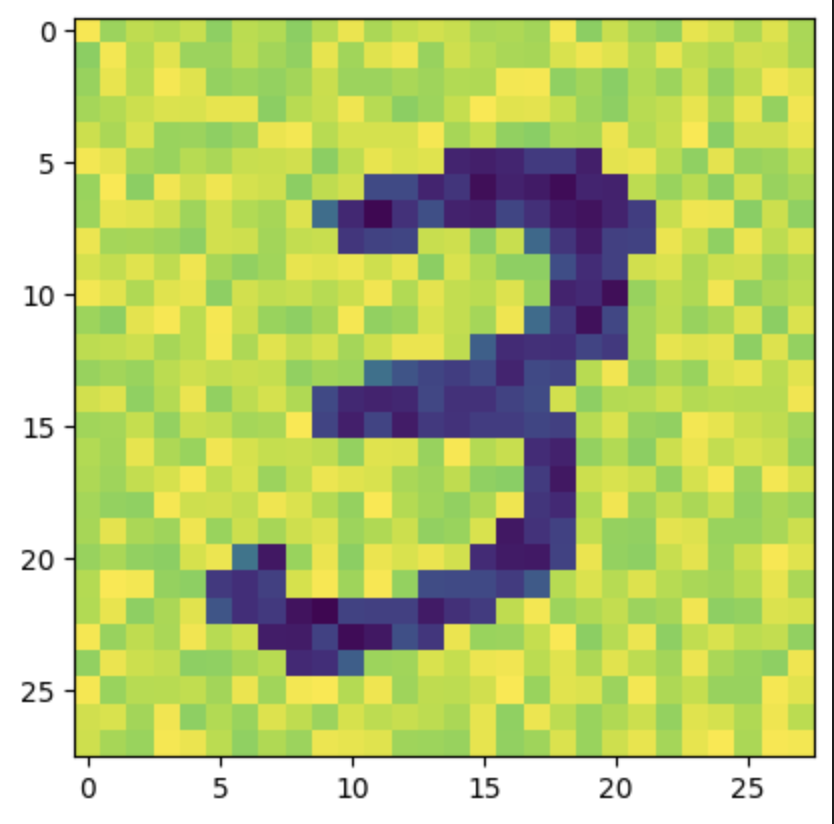
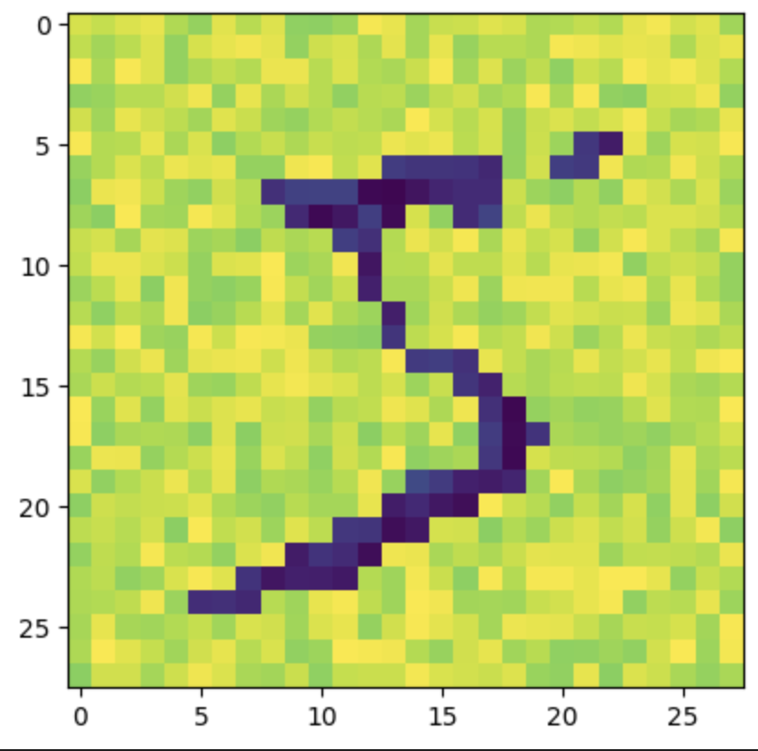

# HebbNet

This repository contains a PyTorch implementation of HebbNet, based on the research paper 
<a href="https://oar.a-star.edu.sg/storage/2/2jep0k6mw7/gupta.pdf" target="_blank">HEBBNET</a>, showcasing a neural network architecture with Hebbian learning principles.


## Overview

In this repository, the code showcases the implementation of HebbNet, where one layer of the neural network follows the Hebbian learning rule, allowing weights to adapt based on input correlations. Meanwhile, the other layer employs backpropagation, a supervised learning technique, to fine-tune the network's output through iterative training with labeled data.

The architecture of HebbNet demonstrates a synergy between Hebbian learning's unsupervised nature, mimicking neural plasticity in the brain, and the supervised learning of backpropagation, resulting in an effective learning framework for certain types of tasks.

## Results

After training and evaluating the HebbNet model on the MNIST dataset, the following results were obtained:

- **Training Accuracy:** Achieved an average training accuracy of 94.4%.
- **Test Accuracy:** Achieved an accuracy of 92.7% on the test dataset.

### Visualization of Weights

The visualization below showcases the learned Hebbian weights after training on the MNIST dataset:




The results demonstrate the effectiveness and performance of the Hebbian learning rule in the HebbNet model.


## Additional Insights on HebbNet and Hebbian Learning: 
For more in-depth information about HebbNet and insights into Hebbian Learning, you can explore additional content on <a href="https://medium.com/@reutdayan1/hebbian-learning-biologically-plausible-alternative-to-backpropagation-6ee0a24deb00">my blog</a>

## Project Structure

The project is structured as follows:

- `main.py`: The main script to initiate training and testing of the HebbNet model.
- `model.py`: Contains functions for training and testing the HebbNet model.
- `hebb_net.py`: Defines the HebbNet architecture and related Hebbian learning mechanisms.
- `visualization.py`: Offers a function to visualize weights learned by the HebbNet model.

## Requirements

To execute the code in this repository, ensure you have:

- Python
- PyTorch
- torchvision

To set up the necessary environment, create a conda environment using the provided `env.yml` file:

```bash
conda env create -f env.yml
```

## Usage

To train and evaluate the HebbNet model, run `main.py`.

```bash
python main.py
```

## Acknowledgments
The implementation follows the principles of the HebbNet paper and utilizes PyTorch functionalities for neural network development.

Feel free to contribute, report issues, or provide feedback to enhance this project further!
